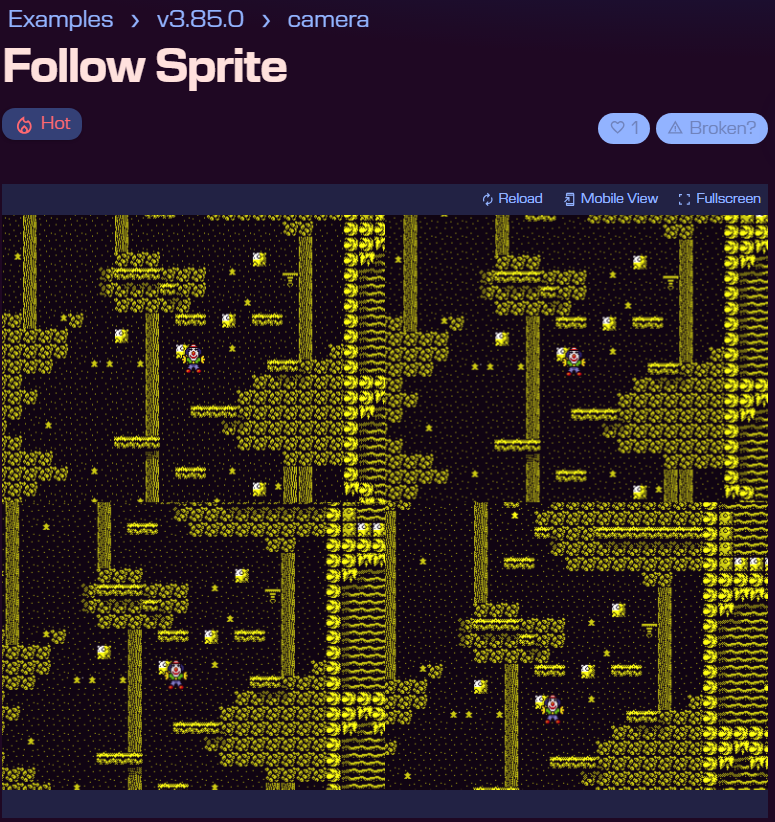
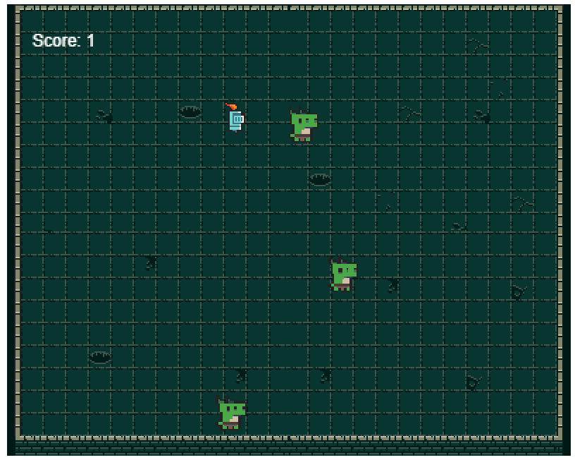
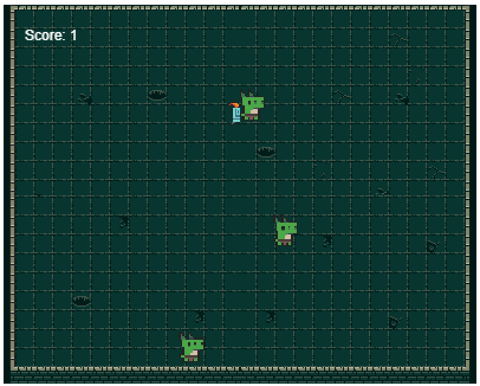
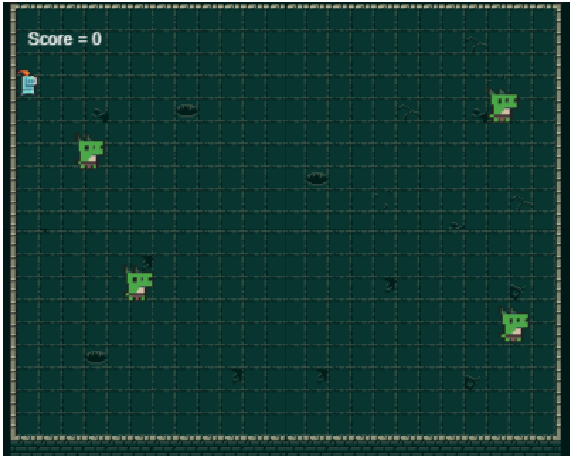
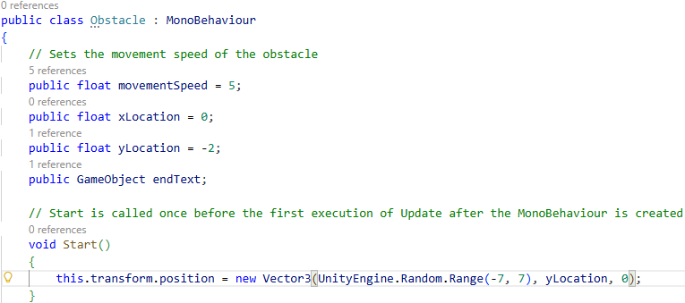
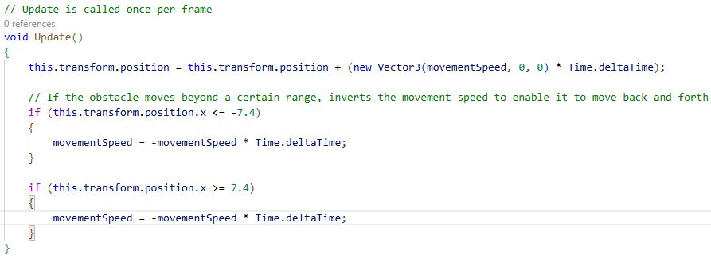
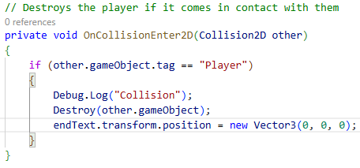
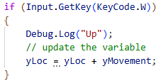
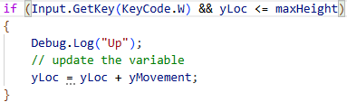
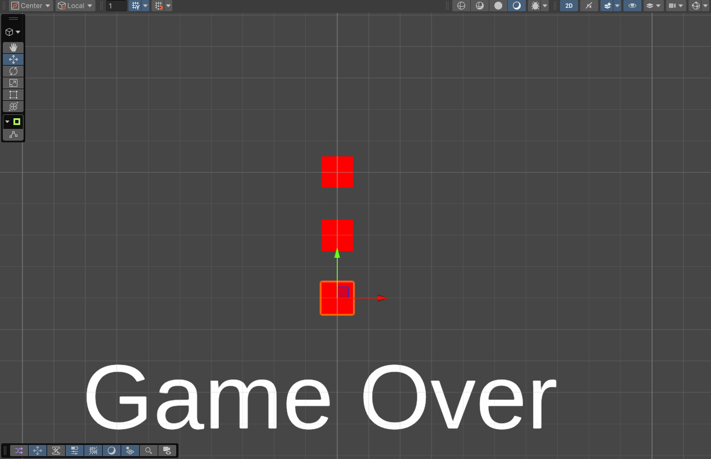

# Journal

## Make A Thing: Dungeon Crasher ((22/01/2026))

### Initial Idea

In one of my previous programming classes, I was introduced to the browser supported game engine Phaser that enables developers to create games that can run on web browsers. I was quite impressed by its wide array of features for a game engine tailored to making web-based games. While I was looking at the various examples of code on their website, one of them stood out to me. It was a code setup that enabled [multiple cameras to be used within the same display area](https://phaser.io/examples/v3.85.0/camera/view/follow-sprite). I thought to myself that something interesting could be done with this system and I decided to build a game starting from this system.

### Development Process

From this initial idea, I studied the possible applications of such a feature in a game. It could be used in a puzzle game to highlight objects that you must find in a large map. It could be used in a multiplayer game to enable two players to explore a vast space within the constraints of a single screen/game window. I finally settled on creating a game where the player must defeat enemies across a large stage, but the player can only see its four corners. 
The game’s main level is simply a very large square, but I adjusted the zoom and position of each camera to create an illusion that brings the players to believe that the stage is much smaller than it is due to how the tiles align perfectly at the edge of each camera. Creating a surprise effect when the player sees his character leave the screen

In this situation, a player would probably think: This enemy seems close; I’ll go defeat him.

But then suddently, the game catches him by suprise. He gasps: What? I cannot reach him? I’m leaving the screen?

In the areas that the player cannot see, there are a multitude of obstacles that can block their way. Consequently, the challenge this game presents to the players is that they must successfully navigate across obstacles positioned in the areas of the map that they cannot see to reach the enemies that only spawn in the four corners of the map.

After creating the bulk of the game, I continued to look at more of the examples on the Phaser website and I discovered a camera effect that enables [adjusting the pixelization of the camera's rendered space](https://phaser.io/examples/v3.85.0/fx/pixelate/view/pixelate-transition-scene). I tested implementing it in my game and I realized that it improved the illusion that I created beforehand. I was happy with the result, so I kept this camera effect on in the game.

A pixel perfect image is rendered, everything is quite distinct.

The blur caused by the pixelate filter creates a retro game impression, also helping in concealing the illusion.

### Concluding Thoughts

This smaller project was a good creative exercise for me. It was able to practice developing a project from a single strong idea/concept. Study and explore the potential avenues from this initial idea before finally adapting and transforming it into something playable. I have worked on various games before, and their development mostly started with an amalgamation of ideas/mechanics, and it can be quite easy to get entangled in trying to make them all coexist. So, developing a game from a singular idea this time, building mechanics and complexity starting from a single baseline, was a valuable experience.

## Unity Exploration: fallAsleep2025_+ ((29/01/2026))

### Initial Idea

To explore the Unity game engine and further familiarize myself with it, I decided to modify and insert additions to the fallAsleeep2025 project that was in the class's archive. The fallAsleeep2025 project is a game where you must catch falling yawning emojis. To add some spice to the game, I decided that I will add obstacles that the player will have to avoid. Since I didn't want to do anything too difficult, I though these additions would be a fair challenge for someone at my level.

### Development Process

After downloading and opening the unity project, the first step was to create the obstacle object and the script that will enable its functions. For the purpose of this game, the obstacle should be able to move horizontally within the confines of the screen/camera's rendered space and it should be able to destroy the player character. To simplify things, I decided to pack all of the funcitons needed to acheive this within a single script as I am not familiar with how to set up dependencies and references across scripts in Unity.

The script begins with the creation of all the necessary variables for each obstacle to function properly. The xLocation and yLocation help set the obstacle's location when the game starts. The movementSpeed variable decides how fast the obstacle can move and a publig GameObject slot lets me connect the obstacle to the text object that will display the game over screen if the player ever collides with it.

The start function's goal is to set the position of the obstacle upon starting the game. Originally this would be set manually, but then I noticed that it would make every playthrough the same. So I used the UnityEngine.Random function to chose a random number within a specific range (between -7 and 7). Which will make the obstacle spawn at a different position horizontally each time.

Making the obstacle move wasn't too difficult. In the update function, I simply added the movementSpeed value to the x position of the obstacle. I also added if statement to prevent the object from leaving the camera's bounds by inverting the value of the movementSpeed variable. When I initially tested this setup, the obstacle moved too quickly. So I multiplied the value used to move the object by the Time.deltaTime. Which is the time between each frame. This helped stabilize the obstacle's movement as it was very inconsistent and jittery.

To enable the obstacle to destroy the player upon collision. I gave the player's sprite and the obstacle's sprite a rigidbody component to enable collision detection. Then, copying the logic found in the collector script that enable it to catch the falling emojis, I tagged the player as "Player" and enabled the obstacle to destroy gameobjects with said tag. To display the phrase "Game Over" upon being destroyed. Since I didn't know how to adjust text opacity within Unity. I simply positionned the text outside of the camera's view and simply changed its position to be within the camera's view to make it apprear.

Making one obstacle is nice, but then I though to myself. "One is a little boring, Why not make three!" So I duplicated the obstacle object to create 3 different obstacles, set them up at different heights, and enabled the player to move upwards and downwards to maneuver around all of them.

To make the player able to move up and down, I copied the current logic that enables them to move left and right and adjusted it to enable vertical movement. I added a yMovement variable and by pressing a key, it gets added or it is subtracted to the current yLoc value.

But with that setup, the player can reach a near infinite positive or negative y value. So I added a maxHeight and minHeight value to constrain the player's vertical movement. 

I finally ended up with a scene setup like so, with 3 obstacles, 1 player and the "Game Over" text just outside the camera's view.

### Concluding Thoughts

I was able to meet all of the goals I set for myself in this little explorative project. I must admit though that some of the solutions that I found to solve my problems here aren't perfect. For example, sometimes, despite the current coding logic, the obstacles will exit the camera bounds because it moved faster than the script could process its x position. Constraining objects within specific bounds is something that I will have to study more as this type of feature is quite present in many modern video games and it is very likely that I will need to know how to implement this in a foolproof manner.

