# Journal

## Make A Thing: Dungeon Crasher ((22/01/2026))

### Initial Idea

In one of my previous programming classes, I was introduced to the browser supported game engine Phaser that enables developers to create games that can run on web browsers. I was quite impressed by its wide array of features for a game engine tailored to making web-based games. While I was looking at the various examples of code on their website, one of them stood out to me. It was a code setup that enabled [multiple cameras to be used within the same display area](https://phaser.io/examples/v3.85.0/camera/view/follow-sprite). I thought to myself that something interesting could be done with this system and I decided to build a game starting from this system.

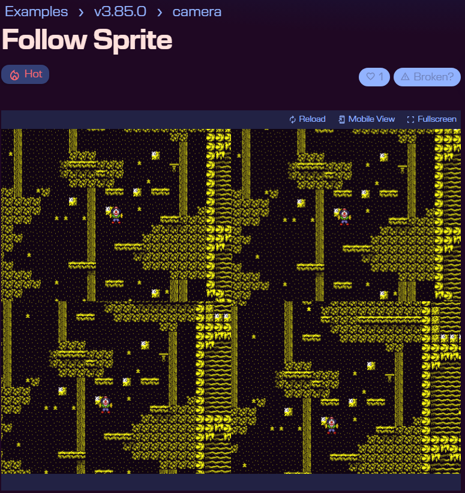

### Development Process

From this initial idea, I studied the possible applications of such a feature in a game. It could be used in a puzzle game to highlight objects that you must find in a large map. It could be used in a multiplayer game to enable two players to explore a vast space within the constraints of a single screen/game window. I finally settled on creating a game where the player must defeat enemies across a large stage, but the player can only see its four corners. 
The game’s main level is simply a very large square, but I adjusted the zoom and position of each camera to create an illusion that brings the players to believe that the stage is much smaller than it is due to how the tiles align perfectly at the edge of each camera. Creating a surprise effect when the player sees his character leave the screen

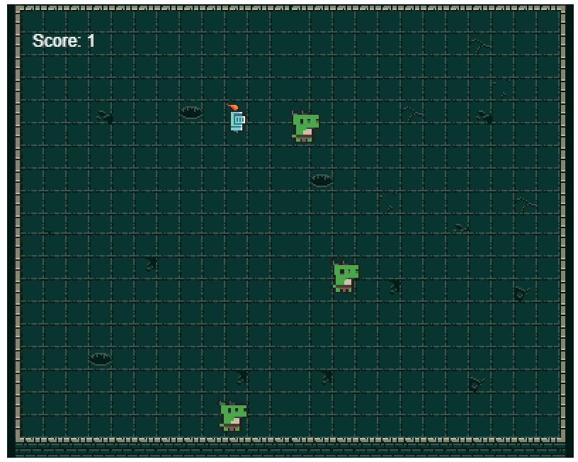

In this situation, a player would probably think: This enemy seems close; I’ll go defeat him.

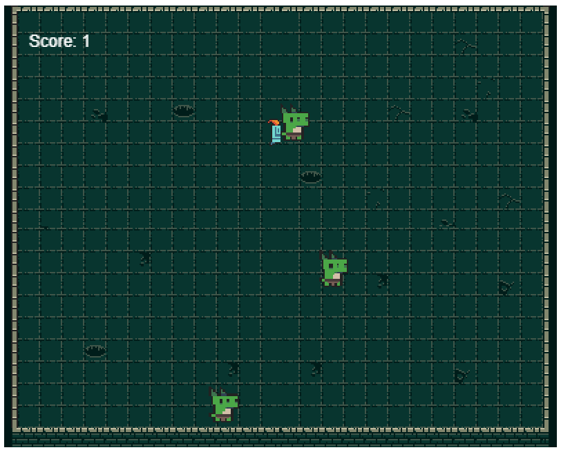

But then suddently, the game catches him by suprise. He gasps: What? I cannot reach him? I’m leaving the screen?

In the areas that the player cannot see, there are a multitude of obstacles that can block their way. Consequently, the challenge this game presents to the players is that they must successfully navigate across obstacles positioned in the areas of the map that they cannot see to reach the enemies that only spawn in the four corners of the map.

After creating the bulk of the game, I continued to look at more of the examples on the Phaser website and I discovered a camera effect that enables [adjusting the pixelization of the camera's rendered space](https://phaser.io/examples/v3.85.0/fx/pixelate/view/pixelate-transition-scene). I tested implementing it in my game and I realized that it improved the illusion that I created beforehand. I was happy with the result, so I kept this camera effect on in the game.

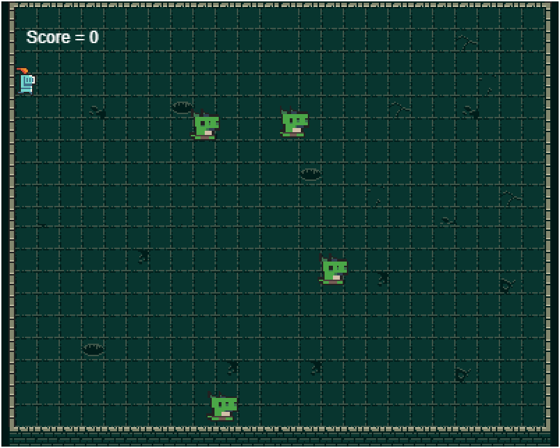

A pixel perfect image is rendered, everything is quite distinct.

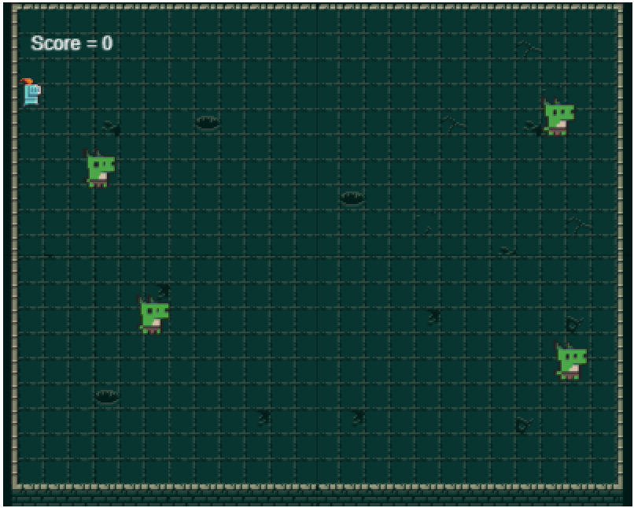

The blur caused by the pixelate filter creates a retro game impression, also helping in concealing the illusion.

### Concluding Thoughts

This smaller project was a good creative exercise for me. It was able to practice developing a project from a single strong idea/concept. Study and explore the potential avenues from this initial idea before finally adapting and transforming it into something playable. I have worked on various games before, and their development mostly started with an amalgamation of ideas/mechanics, and it can be quite easy to get entangled in trying to make them all coexist. So, developing a game from a singular idea this time, building mechanics and complexity starting from a single baseline, was a valuable experience.

## Unity Exploration: fallAsleep2025_+ ((29/01/2026))

### Initial Idea

To explore the Unity game engine and further familiarize myself with it, I decided to modify and insert additions to the fallAsleeep2025 project that was in the class's archive. The fallAsleeep2025 project is a game where you must catch falling yawning emojis. To add some spice to the game, I decided that I will add obstacles that the player will have to avoid. Since I didn't want to do anything too difficult, I though these additions would be a fair challenge for someone at my level.

### Development Process

After downloading and opening the unity project, the first step was to create the obstacle object and the script that will enable its functions. For the purpose of this game, the obstacle should be able to move horizontally within the confines of the screen/camera's rendered space and it should be able to destroy the player character. To simplify things, I decided to pack all of the funcitons needed to acheive this within a single script as I am not familiar with how to set up dependencies and references across scripts in Unity.

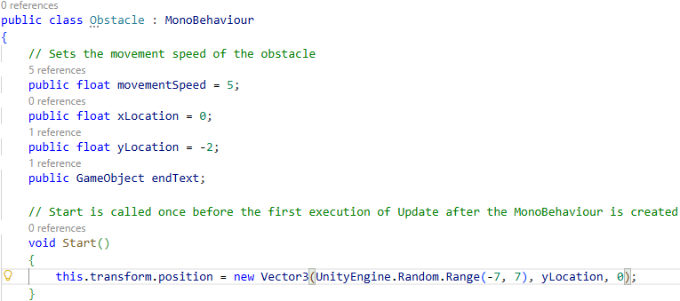

The script begins with the creation of all the necessary variables for each obstacle to function properly. The xLocation and yLocation help set the obstacle's location when the game starts. The movementSpeed variable decides how fast the obstacle can move and a publig GameObject slot lets me connect the obstacle to the text object that will display the game over screen if the player ever collides with it.

The start function's goal is to set the position of the obstacle upon starting the game. Originally this would be set manually, but then I noticed that it would make every playthrough the same. So I used the UnityEngine.Random function to chose a random number within a specific range (between -7 and 7). Which will make the obstacle spawn at a different position horizontally each time.

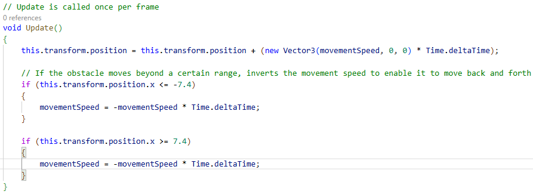

Making the obstacle move wasn't too difficult. In the update function, I simply added the movementSpeed value to the x position of the obstacle. I also added if statement to prevent the object from leaving the camera's bounds by inverting the value of the movementSpeed variable. When I initially tested this setup, the obstacle moved too quickly. So I multiplied the value used to move the object by the Time.deltaTime. Which is the time between each frame. This helped stabilize the obstacle's movement as it was very inconsistent and jittery.

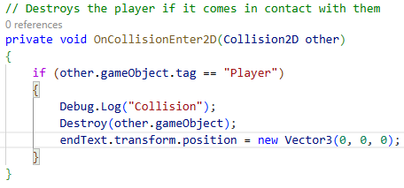

To enable the obstacle to destroy the player upon collision. I gave the player's sprite and the obstacle's sprite a rigidbody component to enable collision detection. Then, copying the logic found in the collector script that enable it to catch the falling emojis, I tagged the player as "Player" and enabled the obstacle to destroy gameobjects with said tag. To display the phrase "Game Over" upon being destroyed. Since I didn't know how to adjust text opacity within Unity. I simply positionned the text outside of the camera's view and simply changed its position to be within the camera's view to make it apprear.

Making one obstacle is nice, but then I though to myself. "One is a little boring, Why not make three!" So I duplicated the obstacle object to create 3 different obstacles, set them up at different heights, and enabled the player to move upwards and downwards to maneuver around all of them.

To make the player able to move up and down, I copied the current logic that enables them to move left and right and adjusted it to enable vertical movement. I added a yMovement variable and by pressing a key, it gets added or it is subtracted to the current yLoc value.

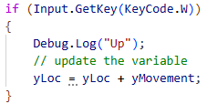

But with that setup, the player can reach a near infinite positive or negative y value. So I added a maxHeight and minHeight value to constrain the player's vertical movement. 

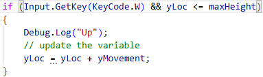

I finally ended up with a scene setup like so, with 3 obstacles, 1 player and the "Game Over" text just outside the camera's view.

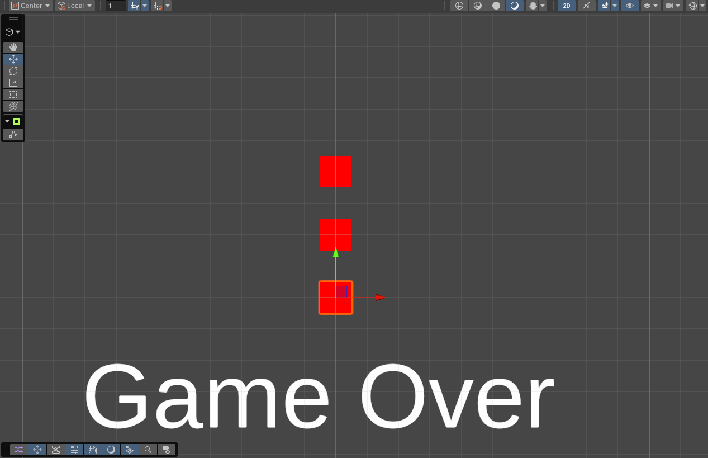

### Concluding Thoughts

I was able to meet all of the goals I set for myself in this little explorative project. I must admit though that some of the solutions that I found to solve my problems here aren't perfect. For example, sometimes, despite the current coding logic, the obstacles will exit the camera bounds because it moved faster than the script could process its x position. Constraining objects within specific bounds is something that I will have to study more as this type of feature is quite present in many modern video games and it is very likely that I will need to know how to implement this in a foolproof manner.

## Pawng evolution ((05/02/2026))

### Initial Idea

Pong (or Pawng here) is a digital replication of the sport of table tennis. Table tennis is a competitive sport for which tournaments are organised quite often. Games that have users compete with eachother must usually balance consistency and randomness in order to creat an experienc that rewards skill, but also doesn't always create or enable players to create the same situations over and over. Pawng, due to being based on table tennis, is a very deterministic game. With these thoughts in mind, I decided to reflect on the balance between consistency and randomness in Pawng and what additions could I do to the game to adjust or disrupt this balance in order to make the game more interesting to play and watch. Since I cannot lie about the fact that playing pawng, as opposed to table tennis, can get a little boring and repetitive.

Why does playing pawng get boring and repetitive? Earlier I mention that this game is a very deterministic game. The actions you take lead to easily predictable/calculable outcomes. There usually is no suprise when you knock the ball back with your paddle. But the rare moments where the ball takes a completely unexpected path after being struck would be the only time where the game demonstrates randomness besides the ball's initial trajectory on round start. So I decided to think about how to introduce more variety and/or randomness in the game in order to reduce the deterministic/consistent aspects of Pawng.

### Development Process

To introduce variety into Pawng, I must first take outline what elements of the game are static and consistent. There is the position, the movement speed, and the size of each paddle, the ball's speed and starting point, the terrain's height/length and the goal area's size (though the last two may change depending on the screen's size).

To manipulate the static and consistent elements of Pawng, I decided to create a randomly rotating state system within the ball's script.

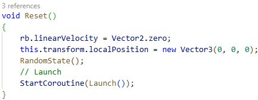

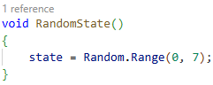

Each time the game's Reset() function is called, the RandomState function is called. This function will roll a random number between 0 and 7. Depending on this number, certain variables will change through if statements that will be triggered by the value assigned to the state variable. Which will be the position, speed, and size of the paddles, the ball's speed and starting position, and the position of the top and bottom walls.

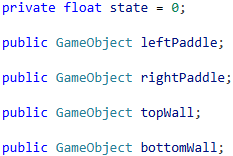

To enable the BallScript to perform the aformetionned actions, I enabled the script to store the relevant game objects for easy referencing.

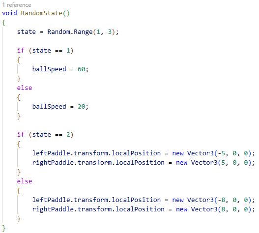

Then, within if statements that rely on the random number assigned to the state variable, I can easily cause modifications to the base state of the game. However, there was a problim with this setup. Since I am using multiple if/else statements. If the requirements for a single if statement were met, it would also execute all other else statements for each if statement whoose condition was not met. Which lead to unwanted results. The only solution I was able to find to this problem was to assign specific variables to every manipulable game object in each state individually and remove all else statements as shown in the picture below. This solution was quite tedious to apply though and would definetly be something that could be improved upon in the future.

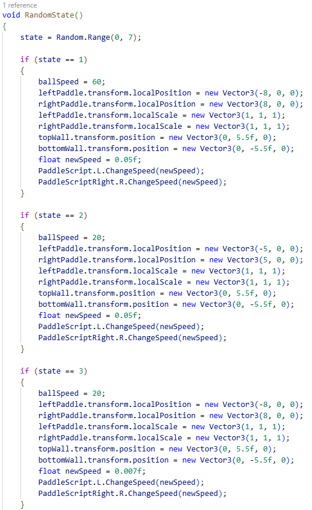

With the completed BallScript, each reset creates various game states. Which helps retain the player's interest as the game will behave differently on each round. Also preventing the game from being monotonous due to being repetitive. I believe that this is an appropriate solution to my initial question.

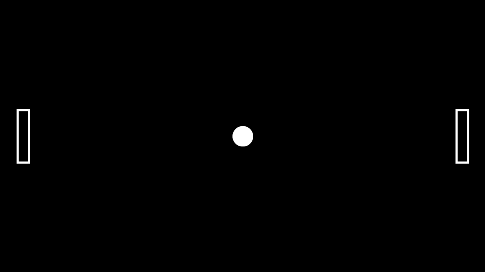

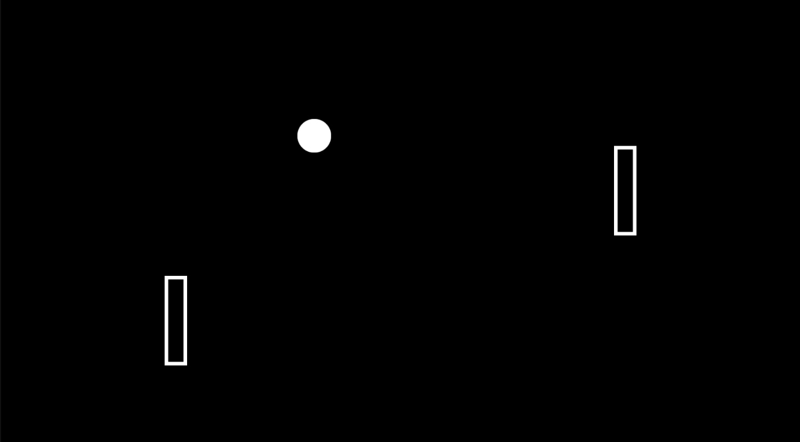

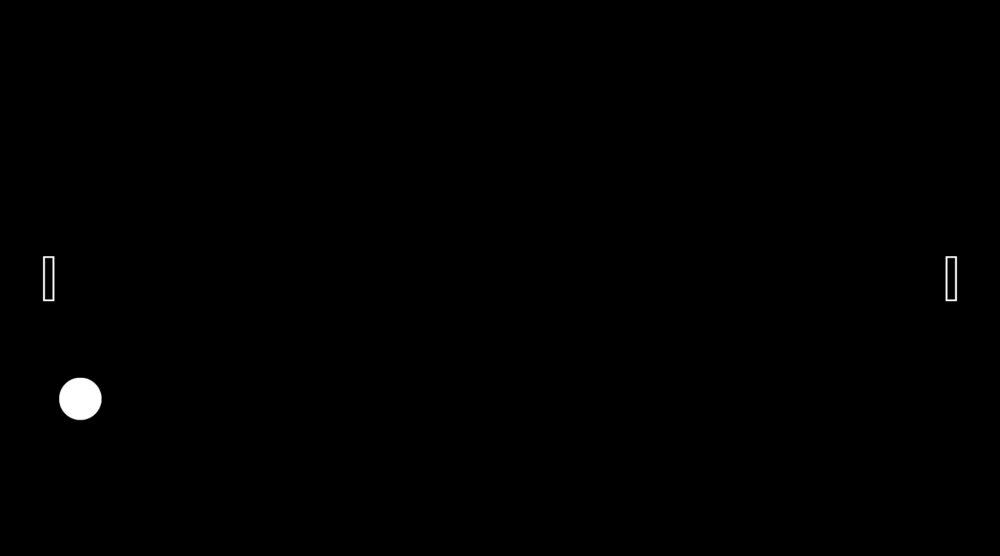

### Concluding Thoughts
Through this project, I learned how to tackle game development through the act of asking a question. Games can be built with the goal of providing an answer to all sorts of questions that someone could asks themselves. In this case, I asked a question regarding the emotional state of players interacting with Pawng. This has led me to theorize and study the various aspects of the game that can lead to this emotional response (boredom), and work on these outlined aspects to potentially change this emotional response for the better.

## Unity Exploration: BreakinOut ((12/02/2026))

### Initial Idea

Last week's exploration project showed me that interesting results can be acheived by introducing inconcistency and variation into a game's static/consistent elements or mechanics. Considering that I wish to build upon the breakinOut project, a classic video game where you must knock a ball towards destructible bricks to destroy them. I must first identify what elements of this game are static and/or consistent.

Within this game, the consistent elements are the paddle's speed and size, the ball's speed and size , the position, rotation, durability and point value of the bricks. Within the previous class, we already figured out how to add some variation to the point value of the individual bricks. So starting from there I decided to implement variation to the bricks' position and durability.

### Development Process

Taking inspiration from the code I wrote to include obstacles in the first week's exploration, I enabled the bricks to move left and right and to change their movement's direction when colliding with one another and added a Collision2D component. To prevent the bricks from always moving in the same direction, the initial movement speed and direction of each brick will be randomly assigned.

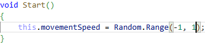

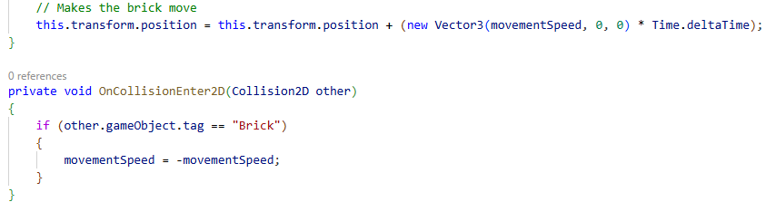

However, after compiling the code and hitting the play button, this is what the play area looked like.

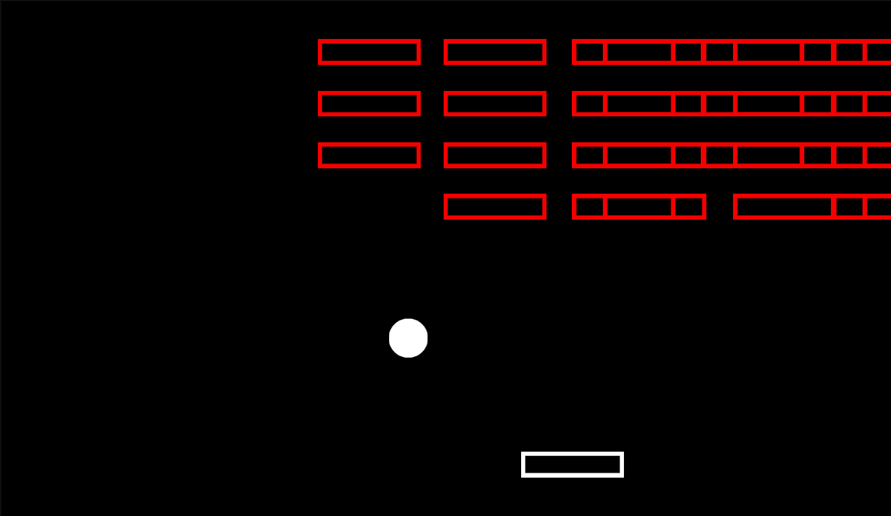

The bricks moved properly, but overlaped eachother instead of colliding because I didn't add a rigidbody 2D component to enable the bricks to collide. After adding the rigidbody 2D component, I tested my program again.

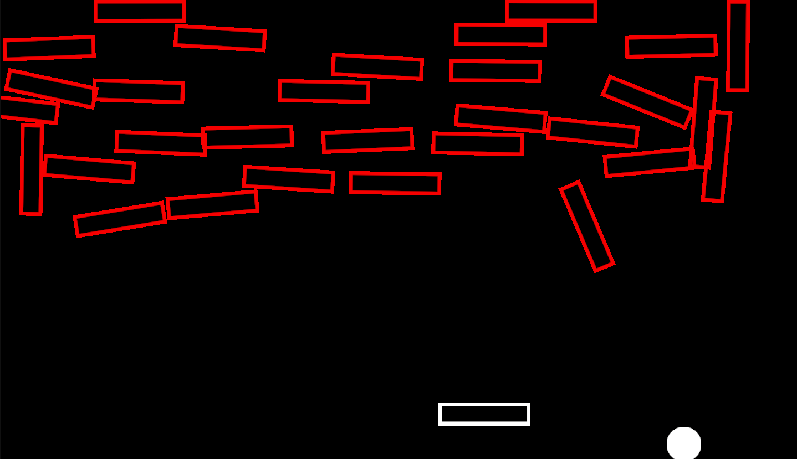

The bricks pushed themselves out of place! Maybe this effect could be interesting for a future project, but it wasn't what I was looking for here. So I adjusted the rigidbody 2D settings to lock the y position and the rotation of the bricks to prevent them from rotating and from moving up and down.

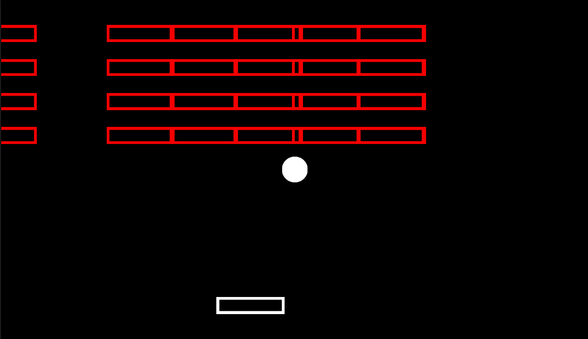

This time the bricks clipped into eachother and got stuck. Which made their movement behave improperly. I assumed that the problem was that the bricks lacked space, which causes them to collide with eachother too frequently and consequently end up clipping into eachother. So I created a new brick prefab that is smaller than the original brick in order to leave more space between each one.

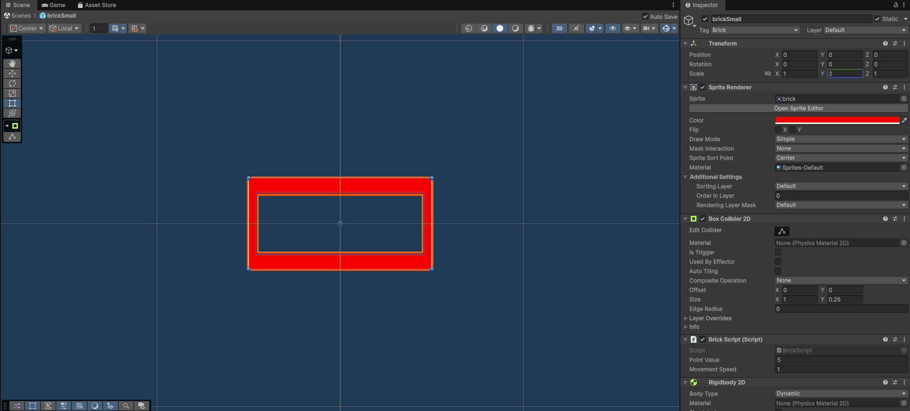

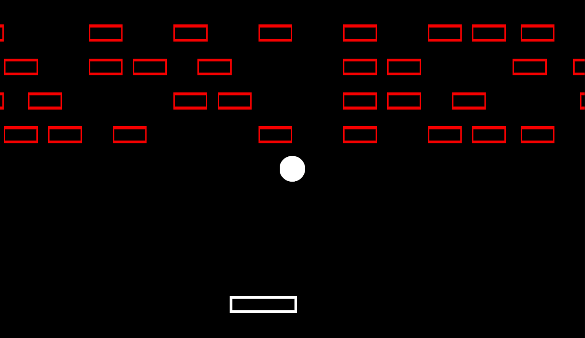

The bricks no longer clipped into eachother thanks to the extra space they have to move in now. However, some bricks are static. Probably due to the fact that the Random.Range code line includes the value 0. So I created a setup that should hopefully avoid assigning the value 0 to any brick's movement speed.

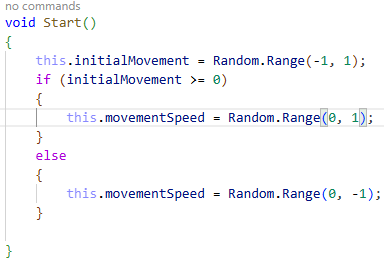

But after compiling, I have met another problem.

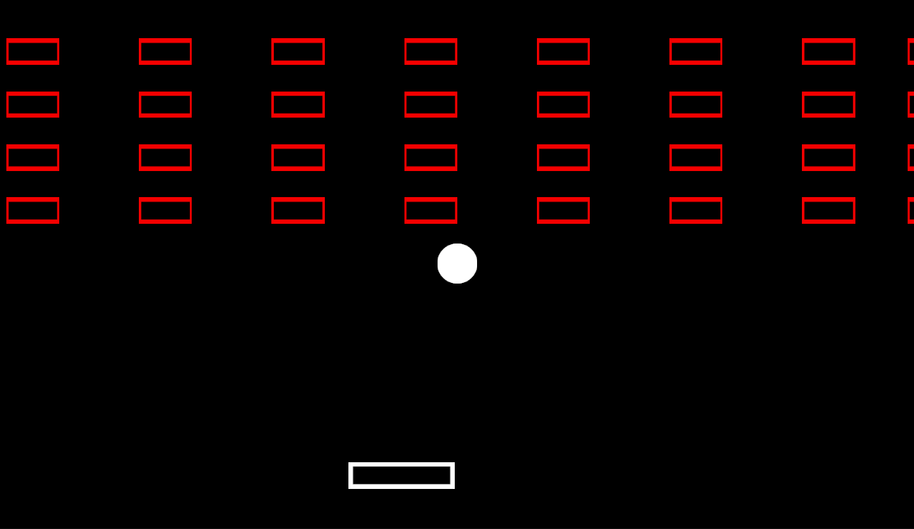

The bricks are not moving! And after verifying the moveent speed value of the bricks during runtime, they are all set to 0!

In order to prevent this from happening, I decided to change how movement speed is assigned to each brick. The new method I scripted starts with a new float "initialMovement" and a boolean "initializeMovement".

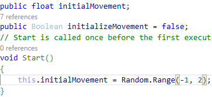

When a brick gets created, a random number within the specified range (-1, 2) gets gets assigned to the initialMovement variable. Then, the assigned value drives the function that will determine the brick's initial movement speed.

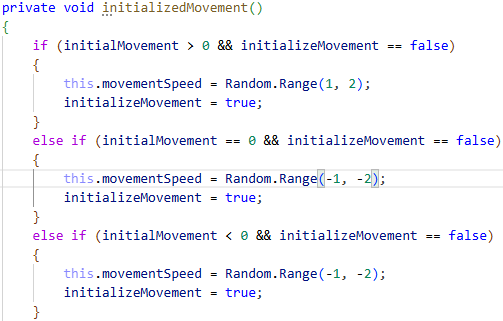

The if and else if statements within the initializeMovement function depend on the value assigned to "initialMovement". If the value is below or equal to 0, the brick's initial movement will be towards the left. If the value is superior to 0, the brick's initial movement will be towards the right. This setup completely avoids assigning the movement value of 0, so no brick stays still. However, the bricks began clipping into eachother and got stuck in large groups again. So I tried another potential solution, which is to increase the size of their collision box.

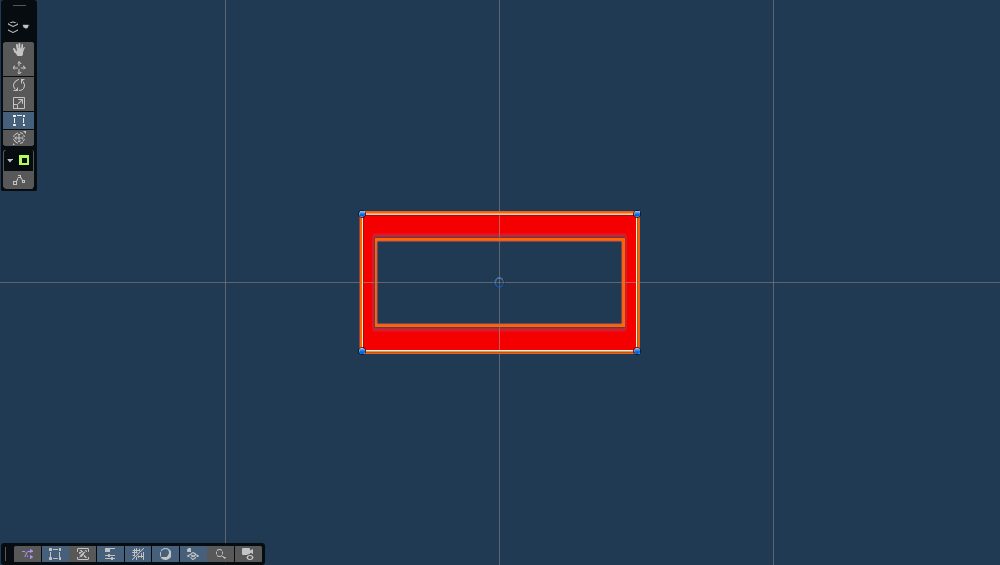

Somehow, this solution wasn't able to solve the problem. The bricks still got stuck, but they had more space between eachother due to their larger collision box.

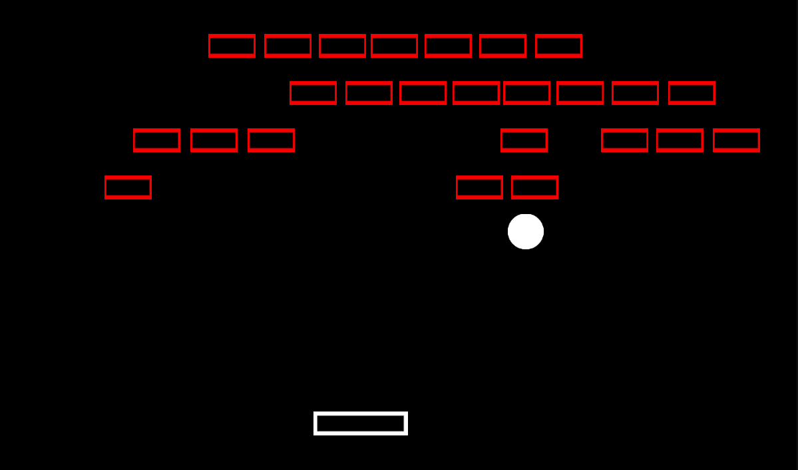

Honestly, since collisions are causing so much trouble, I've decided that I will simply abandon making the bricks change their direction by colliding with eachother and allow them to overlap. So I removed the rigidBody 2D which enabled this behaviour, adjusted the range of available values for movement speed and with this, this exploration prototype is complete. 

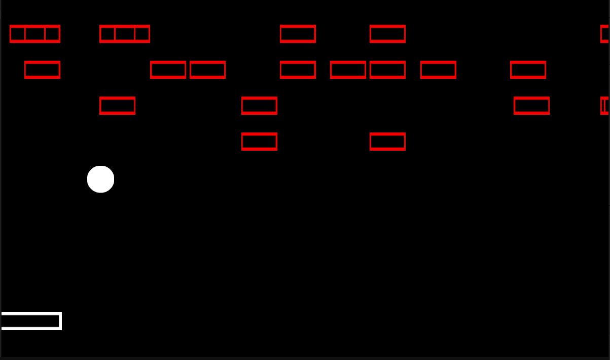

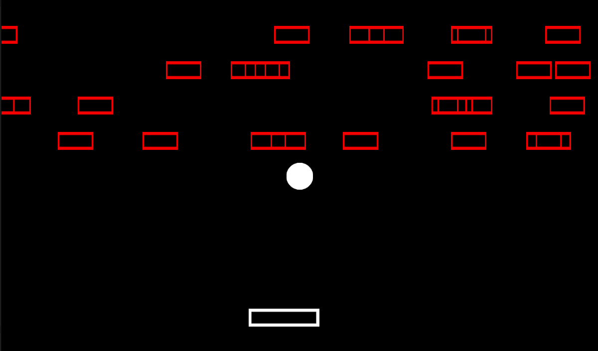

### Concluding Thoughts

Through this exploration, I discoverd the complexity of introducing randomized and continuous variation into a game. Building a game with variation and randomness in mind sadly makes the it very prone to errors and bugs. I am a little sad that I wasn't able to make collisions work. But I am still quite happy with my final result. I now have much greater insight on the reason why video games tend to avoid too much randomness and variation within the game's mechanics/code, because not only it can cause many cases of unintended behavior, but also make the game difficult with how annoying it is to do certain things. For example, when I tried playing my complete prototype. I realized that the less bricks there were, the more annoying ther were to destroy, especially those that moved too quickly. It's nice and all that the game never behaves in a repetitive manner thanks to randomness and variation, but it is also important such things must have the smallest impact possible the game's playability. Lest you piss off your playerbase and end up with nobody playing your game because its too "random".

## Unity Exploration: Level Based BreakinOut ((19/02/2026))

### Initial Idea

Considering how in the following weeks we will begin developing a project on a larger scale, I wanted to eget a little head start by experimenting on a longer gameplay loop with added complexity. Looking back at my previous BreakinOut project, I tought that it could be an interesting experiment to try to create an expansion to this game by building something new ontop of its current gameplay loop.

A great way to create something new based on an existing game is to change or transform the game's mechanics. The game that I am modifying here, a classic brick breaking game, is played by launching a ball towards a brick using a paddle in order to gain points while avoiding letting the ball reach the bottom of the screen. The game usually takes place in a small square or rectangular arena and the player can take advantage of the walls to send the ball towards the bricks. With these basic mechanics outlined, I had to decide which one I would adjust in order to create a longer gameplay loop that feels fresh and innovative compared to the original game. I thought to myself that It could be interesting to go for modifying the arena in which the game could take place. Then, I got the idea that I could combine elements of the platformer genre with this game. Creating a game where you (the paddle) must navigate across various levels while using the ball to remove obstacles in your way and/or to create new paths. 

### Development Process

I began by creating the level the game will take place in. It wasn't too difficult to make using primitive shapes. I also had to adjust the size of the paddle, the ball and both their speed values due to the change of size.

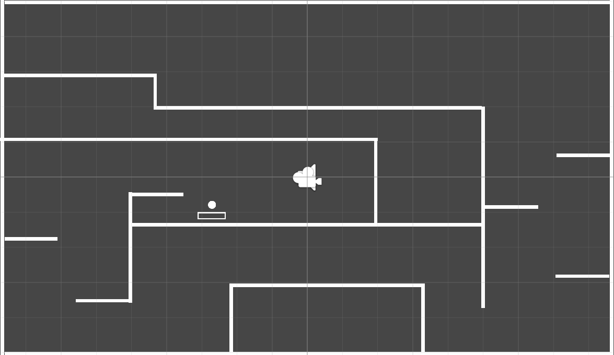

Then, I wanted to add obstacles. To create them, I simply duplicated the bricks used in the original game, adjusted their size, and removed the brickScript which made them move since I wanted them to stay still.

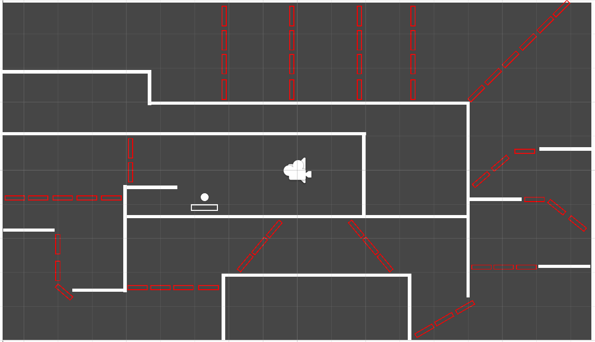

Finally, to make the level end, I created a yellow colored brick that when destroyed, would change the scene to the game over screen. I put this brick at the end of the level.

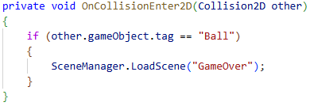

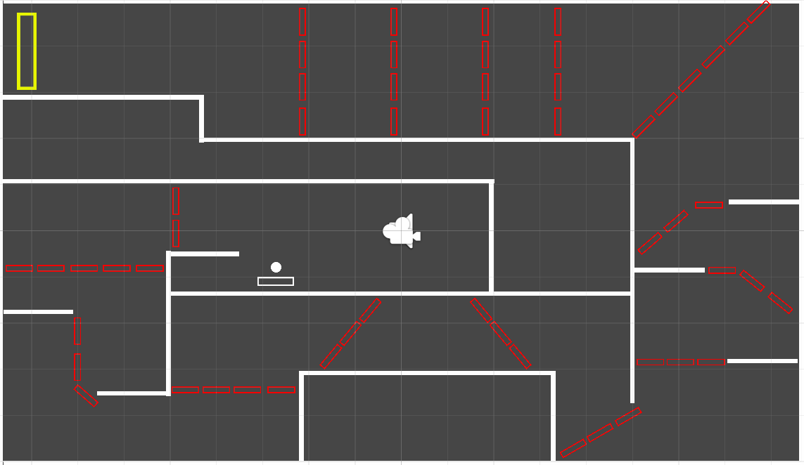

Then, to enable the player to properly navigate across the level, I had to enable him to jump. So, in the paddleScript, I added code to enable the paddle to jump.

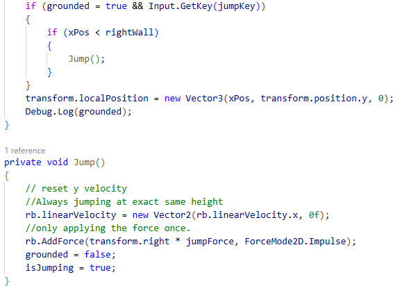

To make the player jump, the script adds a vertical velocity to the player. And to disable jumping mid air, I used an isJumping boolean that is set to true when the player hits the jump key and that only returns to fals when the player collides with the ground. However, the collision system didn't work very well and the player could still jump mid air as if he was flying. I tried multiple other methods to fix this, but in the end, I left it as is because I thought that despite being an unintended behaviour, It reinforced the importance of the ball in clearing the obstacles. The player's movement is free and unrestricted, but he cannot bypass the obstacles.

With all of this, the game worked relatively well. However, an annoying problem surfaced during gameplay.

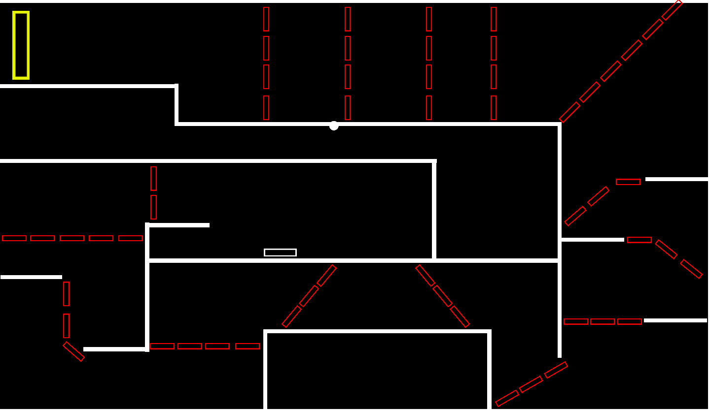

The ball went out of bounds!

I theorized that the ball went out of bounds due to its speed. When going over the ball's script. I noticed that I forgot to make it recognize the ground and execute the speedCheck() function upon collision, so I added that in the script in hopes that it would fix my problem.

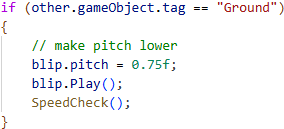

Sadly, It did not fix my problem. the ball kept reaching ridiculously high speeds. So I decided to make the ball heavier instead to prevent it from accellerating and moving too quickly. I increased the ball's mass from 0,01 to 1. Weakening the application of kinetic force on it and sucessfully slowing down its movement overall. The ball no longer went out of bounds. 

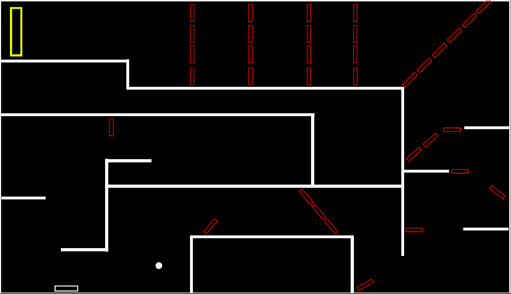

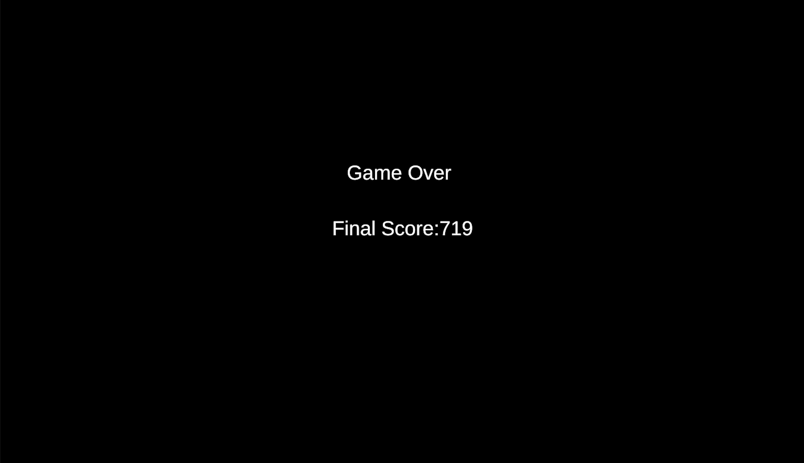

Also, since the obstacles are bricks, the player's score will vary depending on how many obstacles they destroy. They aren't forced to destroy all of them to complete the level. But to obtain the highest score possible, they will have to destroy all of them. This adds an extra layer of challenge for those who are interested.

### Concluding thoughts

This project was an interesting opportunity to try adding a twist to an existing game genre/gameplay loop. I've seen many cases where innovation in the landscape of games and video games was acheived through this technique and I understand no why it works so well. Reminiscing on the concepts of randomness and variation that I explored in the earlier weeks, you can create an incredible amount of changes and variation in a preexisting game by tweaking a few variables or changing rules. Here, I changed the rules of the traditional brick breaking game and transformed it into a completely new experience while also retaining some connection to the original by adapting its gameplay and feedback loop to a new environment: a platforming game.

## Session Project: Brainstorming ((25/02/2026))

The first step to a project is the idea behind it, working without a clear idea of what I want to make can lead to a headless chicken scenario. So I wanted to start this project by writing down the details of the project that I will be working on. The brain dump done in class helped alot in generating a wide variety of potential projects. During the brain dump, I split the keywords I wrote down into eight categories: 

Guides: Sounds, Warnings, Color, indicators, map, arrows

Space & Style: 3D, verticality, Atmospheric, Stylized, Cartoony, Y2k x Frutiger aero, Bryce 3D, 2000s core

Enemies: Obstacles, targets, moving enemies, jumping enemies, blocking/parrying enemies, invincible enemies

Hazards: holes, fire, slippery floors, traps

Goals: Avoid the ball, avoid the enemies, destroy all targets, reach the ending quickly, survive for x duration

Areas: Garden, city, mountain range, sky, space, volcano, temple, castle, streets

Total results: max speed, avoidance, score, targets destroyed

During the previous weeks' explorations, I developed a greater and greater interest in movement within games and how its behaviour and the actions it can enable to various objects can create interesting gameplay experiences. I decided then that my game will have a focus on movement and environmental interaction. From this focus, I created three potential ideas that I may continue developing in the following weeks.

Idea 1: A movement-based platforming game where you must destroy objects or enemies by striking them with a boomerang. Since it is a boomerang, it is constantly returning to you and if it hits you, you lose.

Idea 2: A Stealth turn-based game where you must stealthily sneak around enemies with limited movement available to you during your turn. You move around by rolling a dice, but you can also manipulate the dice’s result by using the environment (throwing the dice at a wall for example)

Idea 3: A platformer where you must build your way out using your own body. Create duplicates of yourself and adjust their position and rotation to build stairs, ladders, bridges and more.

In terms of ease of implementation, the 1st idea would be the easier one to develop into a playable prototype. The second and third ideas have a much higher base implementation requirements but I do think these ideas are quite interesting and I may merge them into the my project if I am interested. The keywords generated in the brain dump will be a great aid in creating the project. As thanks to them, I already have an idea of what I should implement in my game project and I won't get stuck in the planning process due to having a list of references to pull from.

To test out the 1st idea, I revised one of my older game projects. It was a game where you had to avoid a growing enemy while gathering collectibles spread across the level. Here I was able to program the enemies to follow the player automatically, which means that I could reproduce this code to make the boomerang move towards the player after being thrown.

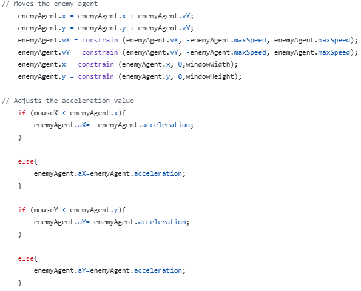

The enemy's x and y acceleration changes depending on the player's position in relation to it. Consequently making it follow the player. This method only takes the x and y axis into account so If I wanted to pivot to 3D, I would have to include the z axis too. But I'll decide that later.

## Session Project: 2003D Breaker development begins! ((11/03/2026))

### Before development: Solidifying the idea of 2003D Breaker

Last week, I mentionned the importance of having a solid idea behind a project. Following my own advice, I firstly debated on which idea I came up with to expand upon. The 1rst idea came out as the winner. From this, I created a document outlining the majority of the project while leaving some space for some changes in case I change my mind on some things or I get inspired to add extra things to my project.

Titled 2003D Breaker, this project will be a movement-based platforming game where you must destroy objects or enemies by striking them with a boomerang like weapon. The game's special twist is that you cannot catch wour weapon after it is initially thrown and your weapon can hurt you. Additionaly, since it is a boomerang, it will constantly attempt to return to you and if it hits you, you will lose life points.

Many of the ideas that I came up with during the brainstorming session will be used in this project:

Guides: Sounds, Warnings, Color, indicators, map, arrows

Since I am making a platformer, I could simply organize the level's design to naturally guide the player towards the end of the level. If needed, I may incorporate color codes, warnings, arrows and indicators in areas with less intuitive traversal paths.

Space & Style: 3D, verticality, Atmospheric, Stylized, Cartoony, Y2k x Frutiger aero, Bryce 3D, 2000s core

I think that platformers benefit greatly from 3D space, so I will be making the game in 3D in Unity. In terms of visual style, if my available time allows it, I find stylized retro visuals very attractive. So I would definetly like to emulate this style within my game (again, if my time allows it, I'll focus primarily on prototyping and making the mechanics work).

Enemies: Obstacles, targets, moving enemies, jumping enemies, blocking/parrying enemies, invincible enemies

Hazards: holes, fire, slippery floors, traps

Enemies and hazards are a staple in platformers. I will definetly include enemies in the game and giving them the ability to block in a specific direction for example could creat interesting scenarios where the player must make clever use of the boomerag weapon's motion path. Traps also could create interesting dynamics with the boomerang weapon as the player will have to be wary of them alongside his own weapon.

Goals: Avoid the ball, avoid the enemies, destroy all targets, reach the ending quickly, survive for x duration

The game's primary goal is to complete the level. Extra secondary goals could be to complete it without getting hit, complete it in under 1 minute, etc...

Areas: Garden, city, mountain range, sky, space, volcano, temple, castle, streets

These are all fantastic potential areas for levels, but since this is a prototyping class, I will probably have to focus on making 1 level first. For the sake of ease of creation, I will probably create a level high in the sky, which would give me the affordance of only having to model floating islands and not having to model the a landscape.

Total results: max speed, avoidance, score, targets destroyed

### Development process: The boomerang

The boomerang-like behaviour of the player's weapon is arguably one of the most important parts of my project. Last week, I returned to one of my older projects and studied the logic I used to code an enemy that follows the player. With the information I gathered from this study, I created the first iteration of the boomerang script which will enable the player's weapon to behave like one.

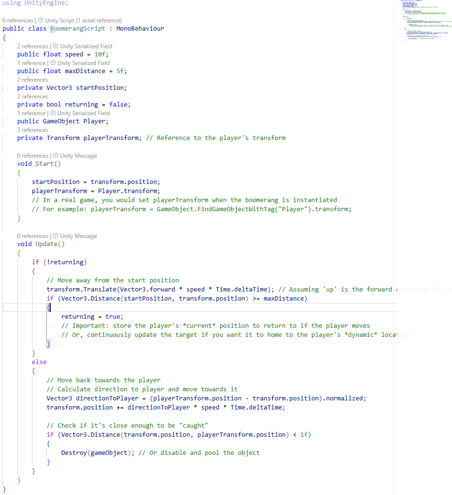

So far, the script begins by storing various variables such as the speed, the maximum distance it can travel before returning, its starting position, a "returning" boolean which will be used to determine whether the boomerang is returning or not, which game object is the player and their position(transform data). Once instantiated, the boomerang flies forward until it reaches the max distance, then the "returning" boolean is set to true and the boomerang begins to return to the player by tracking the player's position and calculating Vector3 transforms that will lead the boomerang to reach the player. This method only enables the boomerang to track the player rigidly, but it's a fair start.

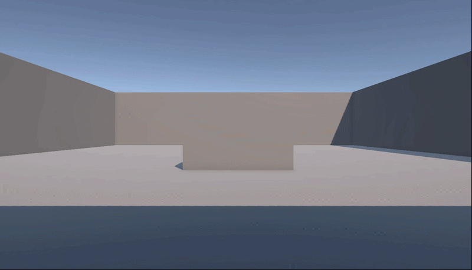

### To-do List
-Boomerang Acceleration
The boomerang script works fine so far, but I need to figure out how to make it accelerate and decelerate naturally as it only moves with a static speed. Figuring this out is very important as it should be what enables the boomerang to overshoot and fly past the player.

-Boomerang return movement
To adjust the boomerang's return movement, instead of continuously tracking the player, I could make it capture and store the player's position once it has reached its max distance and use that position as a point of origin. It will move to that point, then move further until it reaches max distance, then restart this cycle.

-Enemy Programming
Create and program enemies. Take inspiration from the obstacles programmed in the fallAsleep+ project.